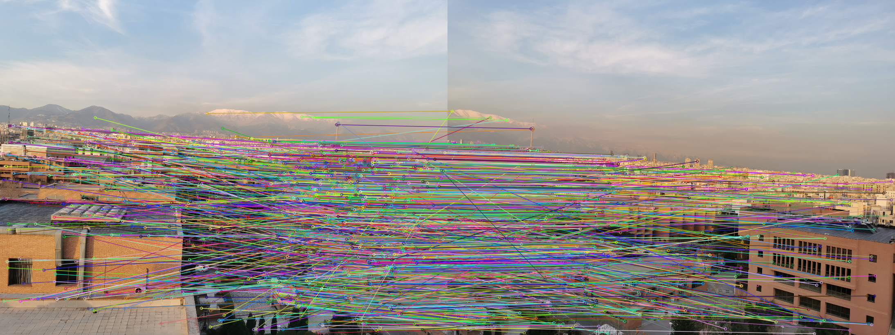

# Panorama
Creating panorama image.

### SIFT
First, we load 2 images and then we use built-in OpenCV SIFT implementation to detect our feature points. Then we use BFMatcher to match points.

### RANSAC

The RANSAC algorithm is implemented to find the best inliers to have a better Homography matrix. At each iteration, we run the RANSAC algorithm to randomly select points(there are maximum num_iterations iterations). Then at each iteration regarding the randomly selected pair points (random_src_pts and random_dst_pts), we find the homography matrix based on these points using the findHomography function. Then as we now have our homography matrix ready, we find all destination points based on source points(src_pts), we call it dst_pts_transformed. Now we have new destination points and we had our original destination points, so we find the difference between the points, and we only select pair of points which have the difference from the original points if they are less than a threshold. At last, we save this inlier if the length of our last set of inliers is less than our newly founded one, otherwise, we realize that these selections of points are not good matches because they could not describe all match points so we delete them and run the algorithm again on the remaining set.

- inliers

- outliers

### Creating Panorama image

